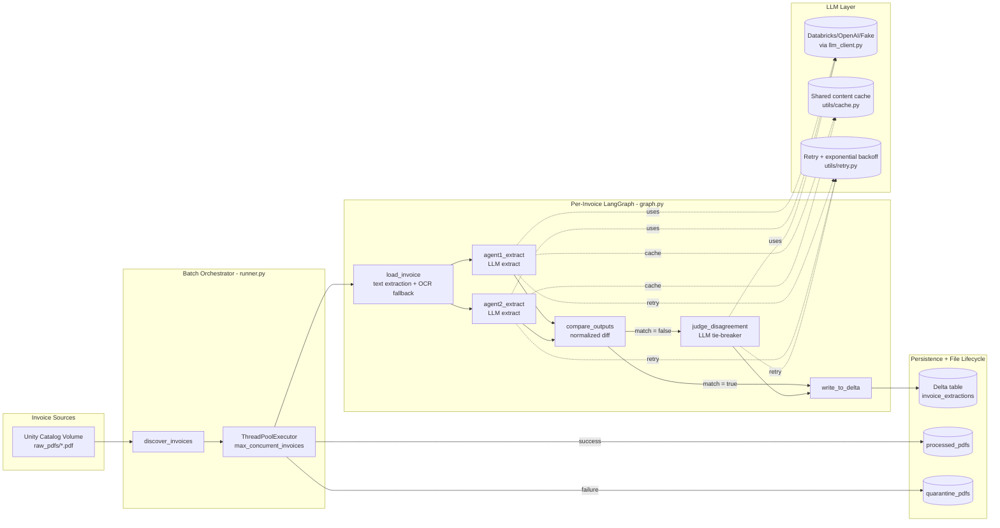

# Invoice Extraction — LangGraph on Databricks

A modular, reusable, multi-agent LangGraph pipeline that turns
unstructured invoice PDFs into structured, reconciled rows in a Delta
table. Adapted from the "two-agent extract + judge" pattern popularized
for BigQuery, rebuilt for the Databricks Lakehouse (Unity Catalog
Volumes + Delta Lake) with SAST/SCA security scanning wired into local
dev, pre-commit, and CI.

## How it works



1. **load_invoice** — reads a PDF from a Unity Catalog Volume (or any
   POSIX path), extracts text with `pdfplumber`, falls back to OCR
   (`pytesseract`) for image-only pages.
2. **agent1_extract / agent2_extract** — two independently-prompted LLM
   calls extract the same structured fields (contractor, hours, rate,
   bill amount, ...) in parallel, so a single model's mistake doesn't
   silently become "the answer."
3. **compare_outputs** — normalizes both outputs (currency formatting,
   casing, whitespace) and diffs them.
4. **judge_disagreement** — if they disagree, a third LLM call re-reads
   the original text and picks a winner, with a justification.
5. **write_to_delta** — persists the reconciled row(s), plus both raw
   agent outputs and the judge's reasoning, to a Delta table for
   auditability and downstream BI (e.g. a Databricks SQL dashboard or
   Power BI/Genie).

## Performance & reliability optimizations

Beyond the initial port, this version adds four production-grade
optimizations that a naive translation of the reference notebook would
miss:

| Optimization | Where | Why it matters |
|---|---|---|
| **Concurrent batch processing** | `runner.py` (`ThreadPoolExecutor`, capped by `max_concurrent_invoices`) | The reference notebook processes invoices one at a time in a `for` loop. LLM calls are I/O-bound, so a thread pool turns a job that took `N × latency` into roughly `N/workers × latency`, without the pickling overhead multiprocessing would add. |
| **Retry with exponential backoff + jitter** | `utils/retry.py`, applied to every LLM call in `extraction_agent.py` and `judge.py` | Model-serving endpoints throttle (429) and occasionally time out under load. Without retries, one transient blip fails the whole invoice; with them, only a genuinely broken call (bad prompt, auth failure) fails fast instead of burning retry budget — the retry logic distinguishes transient errors from real ones. |
| **Content-addressed LLM response caching** | `utils/cache.py`, wired through `ExtractionAgent` | Skips a redundant LLM call when the exact same cleaned invoice text has already been extracted in this batch run — covers job retries and vendors who resend byte-identical invoices under a new filename. Cache is thread-safe and scoped per batch run (not a leaky global), and reports a hit-rate in the batch summary. |
| **Structured batch summary + per-invoice timing** | `runner.py` (`BatchSummary`, `InvoiceRunResult.duration_seconds`) | Every run reports success rate, judge-flagged rows, wall-clock time, and cache hit rate — enough to spot a regression (e.g. hit rate dropping, latency creeping up) from the Job's logs alone, without attaching a profiler. |

None of these change the pipeline's *output* — same extraction, same
reconciliation logic — they only change how efficiently and reliably it
gets there. All are individually configurable via `PipelineConfig` and
default to sensible production values; set `llm.enable_cache=False` or
`max_concurrent_invoices=1` to fall back to the simpler, fully
sequential/uncached behavior if you need to debug an issue in isolation.

## Why this differs from the reference BigQuery/GCS version

| Concern              | Reference (BigQuery)              | This project (Databricks)                          |
|-----------------------|------------------------------------|------------------------------------------------------|
| PDF storage           | Google Cloud Storage bucket        | Unity Catalog Volume (plain POSIX path)              |
| Warehouse              | `bigquery.Client` + hard-coded `SchemaField` list | Delta table via Spark, schema in `storage/schema.py`, append **or** idempotent `MERGE` |
| LLM                     | `ChatVertexAI` hard-coded in module body | Pluggable `llm_client.build_chat_model()` — Databricks Model Serving, OpenAI, or a `FakeChatModel` for tests |
| Agent 1 vs Agent 2 code | Two copy-pasted functions          | One `ExtractionAgent` class configured twice          |
| Config                  | Hard-coded `PROJECT_ID` / table strings in cells | `PipelineConfig.from_env()` — env vars / Job parameters, no secrets in code |
| Error handling           | Prints, notebook cells assume success | Every node returns an error field; `runner.py` isolates per-invoice failures and archives/quarantines files |
| Tests                    | Manual "call it and eyeball the output" notebook cells | `pytest` suite with a scripted `FakeChatModel`, zero network calls |
| Security                 | Not addressed                      | SAST (bandit, semgrep) + SCA (pip-audit, safety, SBOM) in pre-commit and CI |

## Project layout

```
src/invoice_extraction/
├── config.py              # env-driven PipelineConfig (no hard-coded secrets/paths)
├── state.py                # shared LangGraph state schema
├── pdf_loader.py            # load_invoice node (Volumes + OCR fallback)
├── llm_client.py             # pluggable chat model factory (+ FakeChatModel for tests)
├── graph.py                   # builds & compiles the LangGraph app
├── runner.py                   # concurrent batch orchestration: discover, run, archive/quarantine, summarize
├── agents/
│   ├── extraction_agent.py       # ONE reusable class, configured for "agent 1" / "agent 2"; retry + cache built in
│   ├── comparator.py               # compare_outputs node
│   └── judge.py                     # judge_disagreement node; retry built in
├── storage/
│   ├── schema.py                      # Delta table schema (replaces BigQuery SchemaField list)
│   └── delta_writer.py                  # write_to_delta node (append or MERGE)
└── utils/
    ├── retry.py                           # exponential backoff + jitter for transient LLM errors
    └── cache.py                            # thread-safe, content-addressed cache for LLM responses

notebooks/00_run_pipeline.py    # Databricks notebook entry point (widgets-driven)
jobs/invoice_pipeline_job.yml    # Databricks Job / Asset Bundle definition (daily schedule)
tests/                             # pytest suite, no network calls required
security/                           # SAST + SCA configs, scripts, and docs
.github/workflows/security.yml       # CI: SAST, SCA, SBOM, unit tests
```

## Getting started

### 1. Install

```bash
python -m venv .venv && source .venv/bin/activate
pip install -r requirements-dev.txt
```

### 2. Run the tests (no Databricks or LLM credentials needed)

```bash
pytest
```

Every agent/graph test uses `FakeChatModel` with scripted responses, so
the whole pipeline's control flow (match branch, mismatch → judge
branch, per-invoice error isolation) is covered without hitting a real
model endpoint or Spark cluster.

### 3. Run security scans

```bash
make security          # SAST + SCA, human-readable
make security-ci       # same, writes reports/ for CI artifact upload
```

See `security/README.md` for the full tool list and triage policy.

### 4. Configure for your workspace

All configuration is environment-driven — see `config.py` for every
variable, prefixed `INVOICE_PIPELINE_*`. At minimum, for a real run set:

```bash
export INVOICE_PIPELINE_CATALOG=finance
export INVOICE_PIPELINE_SCHEMA=invoices
export INVOICE_PIPELINE_TABLE=invoice_extractions
export INVOICE_PIPELINE_INPUT_VOLUME_PATH=/Volumes/finance/invoices/raw_pdfs
export INVOICE_PIPELINE_LLM_ENDPOINT=databricks-meta-llama-3-3-70b-instruct
```

### 5. Deploy to Databricks

* Upload `notebooks/00_run_pipeline.py` (or import it as a Databricks
  Repo) and attach it to a cluster with `requirements.txt` installed.
* Deploy `jobs/invoice_pipeline_job.yml` as a Databricks Asset Bundle
  resource (`databricks bundle deploy`), or translate it to Jobs API
  JSON and `databricks jobs create --json @...`.
* Grant the job's service principal `READ VOLUME` on the input volume,
  `WRITE VOLUME` on the archive/quarantine volumes, and
  `MODIFY`/`SELECT` on the target schema.
* Point `llm_endpoint` at a Databricks Model Serving endpoint (a hosted
  foundation model, a fine-tuned model, or an external-model gateway to
  another provider) — the pipeline code does not change.

## Extending

* **Add a third extraction agent**: instantiate another
  `ExtractionAgent` with its own `ExtractionAgentConfig` and wire it
  into `graph.py`'s `compare_outputs` fan-in (extend `comparator.py` to
  do majority-vote instead of pairwise diff).
* **Swap the LLM provider**: implement a new `_build_*_model` function
  in `llm_client.py` and register it in `_PROVIDER_BUILDERS` — no other
  file needs to change.
* **Change the persistence target**: `storage/delta_writer.py` is the
  only file that knows about Spark/Delta; swapping in, say, a Postgres
  writer means implementing the same `write_to_delta(state, config) ->
  InvoiceState` contract elsewhere and pointing `graph.py` at it.
